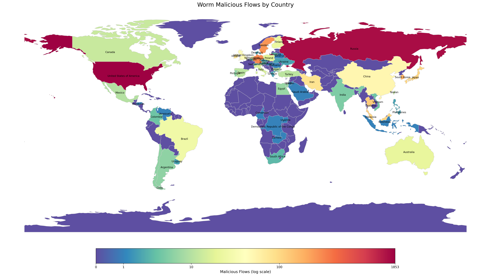

## Construct

Modular pipeline that turns raw **PCAPs → enriched sessions → heuristic scores → CSV/JSON reports**.

#### Modules
- **Session Extraction (`session_extractor.py`)**
  - Parse PCAPs into 5-tuple flows `(src, dst, sport, dport, proto)` with timestamps, sizes, first DNS/HTTP packets.
  - Counters: packet/byte totals, per-protocol and per-direction stats.

- **Feature Enrichment (`feature_engine.py`)**
  - **DNS:** qname, TLD, NXDOMAIN, entropy (full/subdomain), subdomain length.
  - **HTTP:** host, method, URI, user agent, base64-like URI flag.
  - **TLS:** SNI, version, handshake hints (when present).
  - **Timing/Volume:** inter-packet stddev, regular interval flag, session duration, packet/byte counts, burst count.
  - **Payload heuristics:** URI/payload entropy, `contains_exe`, base64 payload, missing UA, suspicious referer, simple mime hints.

- **Scoring Heuristics (`scorer.py`)**
  - Assigns `score` + `reasons` per session.
  - Rules: suspicious ports, DNS entropy/NXDOMAIN/odd TLDs/long AGDs, HTTP anomalies (POST w/o UA, base64 URI, no server response), beaconing (regular intervals).
  - **Strict DNS policy**: whitelist domains override to benign for DNS flows.

- **Reporter (`reporter.py`)**
  - Writes `<pcap>_sessions.csv` (all features, `score`, `reasons`, `malicious`=1 if `score ≥ SCORE_THRESHOLD` and not whitelisted).
  - Writes `<pcap>_summary.json` (totals, top IOCs, offline beacons, TLD/domain counts, DGA-like flags, packet stats).

- **Configuration (`config.py`)**
  - `BENIGN_DOMAINS`, `BENIGN_IPS`, `SUSPICIOUS_PORTS`
  - `SCORE_THRESHOLD`, entropy thresholds, `BEACON_EXCLUDED_PROTOCOLS`

#### Entry Point (`main.py`)
1. Discover `.pcap` under `PCAP_DIR`, create `OUTPUT_DIR`.
2. For each PCAP:
   - `extract_sessions(path)` → `sessions, stats`
   - `enrich_sessions_with_features(sessions)`
   - `score_sessions(enriched)`
   - `generate_reports(scored, filename, OUTPUT_DIR, stats)`

#### Data Flow
PCAP → **extract** (flows) → **enrich** (features) → **score** (rules + reasons) → **report** (CSV + JSON)

#### Run
```bash
python main.py
```

### lstm-classifier.py

Predicts **per-flow malicious/benign** from network-flow CSVs using **variable-length per-file sequences** and an LSTM.

#### Highlights
- **Leakage-safe split:** by file, stratified by file-level positive rate.
- **Features:** `delta_t=log1p(diff(timestamp))`, rolling stats (last 10), port buckets (dns/http/https/ntp/ssdp/llmnr/other), privileged-port flags, `log1p` on heavy-tailed numerics.
- **Columns:** keep numerics + **low-cardinality** categoricals; drop IDs/leaky text.

#### Preprocessing (train-only fit)
- Impute: numerics→median, categoricals→`"__MISSING__"`.
- **Force cats to strings** before OHE (`handle_unknown="ignore"`); scale numerics.
- Remove near-constant numerics.

#### Model & Training
- **LSTM** backbone + small MLP head; **BCEWithLogits** (capped `pos_weight`).
- ReduceLROnPlateau on val **AP**, early stopping; bias init from class prior.

#### Evaluation & Outputs
- Threshold tuned on **validation** (max F1); metrics: AUC/AP/F1/Acc/Prec/Rec.
- Saves: `best_lstm_flows.pt`, `flow_classification_report.csv`, `flow_confusion_matrix.csv`, `flow_metrics_summary.csv`.

#### Run
```bash
python lstm-classifier.py
```

### ml-classifier-byfile.py

End-to-end **flow → model → reports** pipeline with **file-grouped** splits and optional **sample-level** decisions.

#### Highlights
- **Data**: loads CSVs from `analysis_output_benign_baseline_labelled` (benign) and `Ransomware/Spyware` (families).  
- **Target**: `malicious` coerced to 0/1 → `target_binary`.  
- **Leakage control**: **holdout split by FILE** (no file in both train/test).  
  - Holdout: `StratifiedGroupKFold` fold-0 if available, else `GroupShuffleSplit`.  
  - CV: `StratifiedGroupKFold` → `GroupKFold` → `StratifiedKFold` (fallback).  
- **Features**: drops high-card text cols; impute → sparse-friendly scale → sparse OHE (high-card cats dropped > `HIGH_CARD_THRESHOLD`).  
- **Debug**: per-file and per-fold preprocessor smoke tests; basic leakage scans.

#### Models
`RandomForest`, `LogisticRegression(saga)`, `GradientBoosting` (+ optional `LightGBM`/`XGBoost` if installed).  
Scores via CV (accuracy, F1-macro; ROC AUC when `predict_proba` is available), then fits on train and evaluates on holdout.

#### Sample-Level Aggregation (file-only)
Optional **sample (file) classification** from flow predictions:  
`pred_sample = 1` if  
- `n_pred_mal ≥ SAMPLE_THRESHOLD_COUNT` **AND**  
- `n_pred_mal / n_flows ≥ SAMPLE_THRESHOLD_RATIO` (if not `None`)  
Ground truth can be folder-based or flow-derived.

#### Outputs
Creates `model_reports/<timestamp>/` with:
- `loaded_files_manifest.csv`, `label_counts.csv`
- `binary__summary.csv` (per-model CV/holdout metrics)
- Per-model:
  - `binary/binary__<model>/classification_report.csv`
  - `binary/binary__<model>/confusion_matrix.csv`
  - (if enabled) `samples/` with `sample_aggregate.csv`, `sample_classification_report.csv`, `sample_confusion_matrix.csv`
- `README.txt` with run config

#### Key Config
- Paths: `BENIGN_DIR`, `RANSOMWARE_DIR`, `OUTPUT_ROOT`
- Thresholds: `SAMPLE_THRESHOLD_COUNT`, `SAMPLE_THRESHOLD_RATIO`
- Preproc: `HIGH_CARD_THRESHOLD`, excluded columns list
- Randomness: `RANDOM_STATE`

#### Run
```bash
python ml-classifier.py
```

### Plotting scripts

- `plots.py` — early learning/prototyping script retained as a building block and reference.
- `plots2.py` — early learning/prototyping script retained as a building block and reference.
- `plots3.py` — early learning/prototyping script retained as a building block and reference.
- `plot_by_malware_type.py` — **current** plotting entrypoint. Use `plot_by_malware_type.py` for the full, up-to-date set of figures.

### Map scripts

- `geolocate_maliciousip_map.py` — plots malcious flow heatmap by country for one type of malware
- `maliciousip_map_types_combined.py` — plots malcious flow heatmap by country for all types of malware


